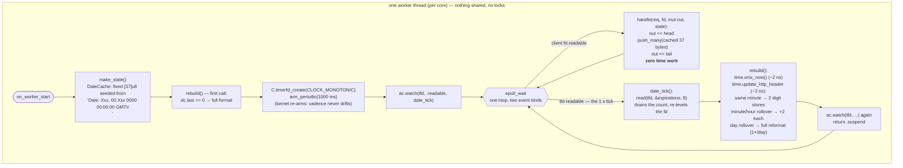

# async_date_timerfd — cached `Date:` header, refreshed by a per-worker timerfd

The architecturally-pure way to send the RFC 9110-mandated `Date` header at
hundreds of thousands of req/s: format it **once per second**, not per request
— and do the refresh **inside each worker's own epoll loop** (the nginx
model), so there is no extra thread, no shared state, no lock, and the request
hot path does *zero* time work: it appends 37 cached bytes.

Time is treated as an **event, not a sleeping thread**: a 1 s periodic
`timerfd` is registered in the worker's reactor as a clientless watch, and its
expiry arrives as ordinary fd readability between requests.

## Requirements

The moving parts live in V's stdlib as of these PRs (until they merge, build V
from the corresponding branches):

| vlang/v PR | provides |
|---|---|
| [#27639](https://github.com/vlang/v/pull/27639) | `time.write_http_header` / `time.update_http_header` (in-place, incremental) |
| [#27641](https://github.com/vlang/v/pull/27641) | `time.unix_now()` — wall-clock second in ~2 ns |
| [#27642](https://github.com/vlang/v/pull/27642) | `C.timerfd_*` declarations via `import time` |

## How it works



The cached line, byte by byte — every refresh rewrites only the digits whose
bucket rolled over:

```text
D a t e :   W e d ,   2 1   O c t   2 0 1 5   0 7 : 2 8 : 0 0   G M T \r \n
0         6                                   23    26    29             37
'Date: '  └────────── IMF-fixdate (time.http_header_len = 29) ──────────┘CRLF
```

## Why it is fast

| operation | cost |
|---|---|
| request hot path | 3 buffer appends — no clock, no formatting, no allocation |
| per-second refresh (same minute) | `unix_now()` ~2 ns + 2 byte stores (~2 ns) |
| day rollover | one full 29-byte reformat — once per day |
| the rebuild this replaced | ~1.25 µs: dynamic-array clear+appends, `time.utc()` calendar math, 2 hidden substr allocations |

The kernel re-arms the periodic timer, so the 1 Hz cadence does not drift with
processing time, and `read()` returns the number of expirations — missed ticks
are *counted*, never silently lost. Because refresh and request handling run
on the same thread, the `[37]u8` cache needs no synchronization at all —
contrast with `examples/date_header`, where a dedicated sleeper thread writes
a cache that worker threads read (double buffering + atomic flip required),
and with `examples/efficient_date`, which refreshes lazily on the first
request of each second (correct, but the clock read lands on a request).

## Run

```sh
v run examples/async_date_timerfd/
curl -i http://localhost:8097/          # note the Date header
sleep 3
curl -i http://localhost:8097/          # Date advanced — with zero load
```

## Tests

`main_test.v` covers this example's wiring: the template/`time.http_header_len`
relationship, the refresh-current-second contract (against
`http_header_string()` as oracle) and the handler's framing. The incremental
update logic itself is oracle-tested in vlib across every rollover
(second/minute/hour/day, forward and backward jumps).
